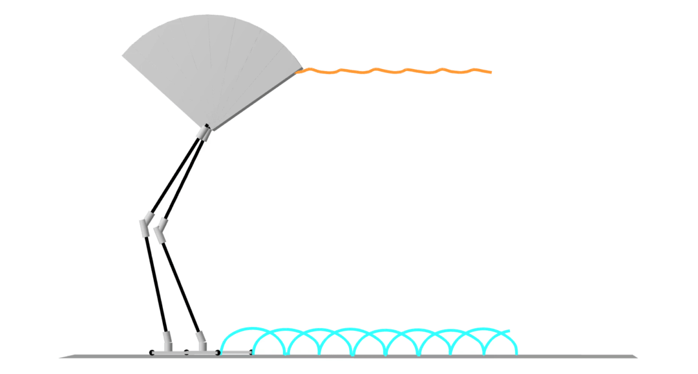
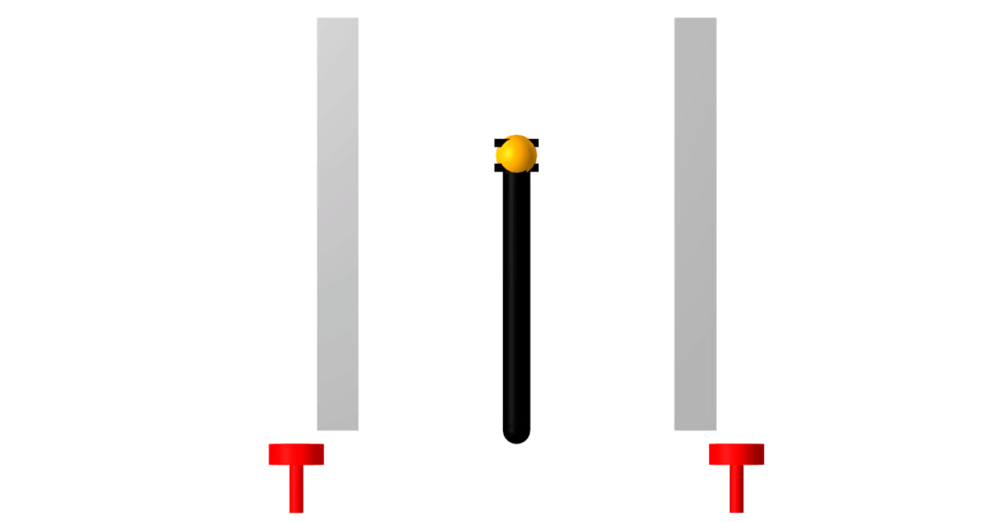

# ContactImplicitMPC.jl
[](https://github.com/thowell/ContactImplicitMPC.jl/actions/workflows/CI.yml)
[](https://codecov.io/gh/thowell/ContactImplicitMPC.jl)

This repository contains algorithms and examples from our paper: [Fast Contact-Implicit Model-Predictive Control](https://arxiv.org/abs/2107.05616).

Notebooks can be generated for the [examples](examples/README.md), please try: [flamingo](examples/flamingo/flat.jl), [pushbot](examples/pushbot/push_recovery.jl), [hopper](examples/hopper/flat.jl), and [quadruped](examples/quadruped/flat.jl). 

## Installation
```
Pkg.add("ContactImplicitMPC")
```

## Flamingo


## PushBot


## Hopper Parkour


## Quadruped with Payload


## Hopper Monte Carlo


## Quadruped Monte Carlo


## Reference Trajectories
The trajectories we track in the examples are generated using [contact-implicit trajectory optimization](https://journals.sagepub.com/doi/10.1177/0278364919849235) and can be run [here](https://github.com/thowell/motion_planning/tree/main/examples/contact_implicit).
